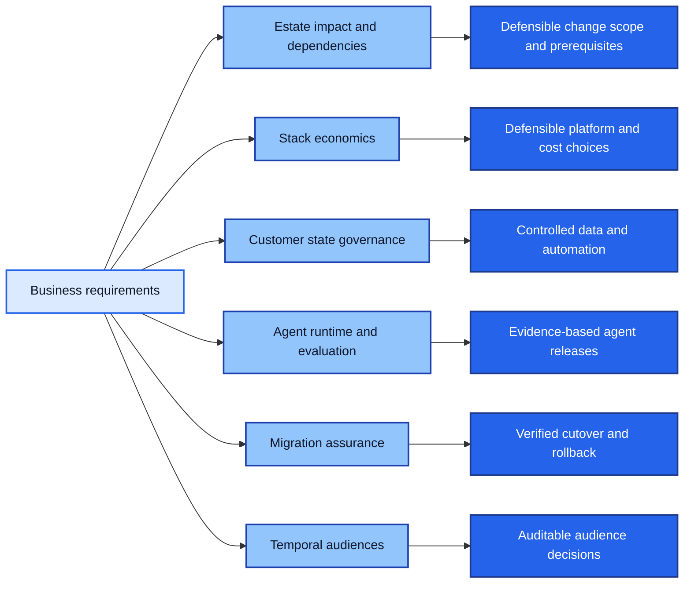

# Richard Butts

**Enterprise MarTech Architecture · AI Systems & Agents · Data Architecture · Platform Optimization · Integration & Migration**

I design and build systems that make marketing technology work as one governed environment. My work connects commercial requirements to technical architecture: choosing platforms that meet cost and performance constraints, preserving customer and revenue meaning across systems, controlling what automation and AI can change, and making migrations verifiable and reversible.

The objective is practical: **more reliable marketing measurement, less manual reconciliation, safer automation, lower avoidable platform cost, and systems that can scale without losing control of their data.**

## Selected engineering work

Six independent, executable portfolio implementations. Each uses synthetic data, links to reproducible evidence, and separates demonstrated behavior from production claims and known limitations.

| Project | Architecture problem | What the implementation demonstrates |
|---|---|---|
| **[MarTech Estate Impact](https://github.com/rlbsem/martech-estate-impact)** | Before we retire or replace a Marketing platform, what actually depends on it? | Evidence-backed estate reconstruction, provenance and conflict handling, typed dependencies, three-state impact analysis, counterfactual retirement/replacement, witness paths, and prerequisite sequencing across a synthetic 24-system estate. |
| **[MarTech Stack Economics](https://github.com/rlbsem/martech-stack-economics)** | How do we reduce integration cost without breaking freshness, capacity, or data requirements? | Mixed-integer configuration planning across shared fees, partial batches, API quotas, regional and capability constraints, and demand spikes. An independent accountant checks the solution; exhaustive enumeration confirms the optimum across 3,125 synthetic configurations. |
| **[Enterprise MarTech / AI Control Plane](https://github.com/rlbsem/enterprise-martech-ai-control-plane)** | Who owns customer truth, and what may an agent or workflow change? | Canonical identity, provenance and field authority, consent and approval boundaries, PostgreSQL-backed durable execution, idempotent downstream effects, retries, uncertain-result recovery, and audit trails. |
| **[Enterprise Agent Runtime & Evaluation](https://github.com/rlbsem/enterprise-agent-runtime-evaluation)** | How do we evaluate an agent and govern release rather than trusting its output? | Actual local LLM inference, evidence-grounded tool decisions, adversarial tests, regression gates, shadow/canary evaluation, observable rollback, and transparent reporting of failed model behavior. |
| **[MarTech Migration Assurance](https://github.com/rlbsem/martech-migration-assurance)** | Can we replace a platform without losing meaning or making rollback unsafe? | Consistent snapshots and change catch-up, versioned schema mappings, independent semantic reconciliation, evidence-bound cutover, process-crash recovery, reverse migration, and explicit rollback blockers. |
| **[Temporal Customer Audiences](https://github.com/rlbsem/temporal-customer-audiences)** | Who belonged in an audience at a given time, based on what we knew then? | Bitemporal customer facts, immutable original and restated audience decisions, time-driven expiry, selective reevaluation, coverage-gated activation, and destination reconciliation. |

**Start with the problem closest to your team:** [estate discovery and change impact](https://github.com/rlbsem/martech-estate-impact), [stack optimization and cost](https://github.com/rlbsem/martech-stack-economics), [AI governance and controlled execution](https://github.com/rlbsem/enterprise-martech-ai-control-plane), [agent testing and release](https://github.com/rlbsem/enterprise-agent-runtime-evaluation), [platform migrations](https://github.com/rlbsem/martech-migration-assurance), or [customer data and audience correctness](https://github.com/rlbsem/temporal-customer-audiences).

### The architecture questions behind the work

*This is a map of independent engineering capabilities, not a claim that these six repositories form one deployed production system.*

## Professional context

My background spans enterprise ecommerce, B2B SaaS, marketing performance, analytics, GTM systems, and enterprise integration across **Lorex Technology, LMN (Landscape Management Network), and Groundbreakers Digital**.

- **Commercial scale:** Managed more than **$65M in paid media and marketing investment** across my career. At Lorex, annual ecommerce revenue grew from approximately **$55M to $101M during my tenure**.
- **B2B SaaS:** At LMN, worked across an approximately **$350K/month USD acquisition program** spanning five products, with CAC improvements of approximately **15–25%**. My work has included Salesforce, Pardot, Marketing Cloud, funnel measurement, and GTM systems.
- **Architecture and delivery:** Founded Groundbreakers Digital and worked across roughly **30 projects** for founder-owned and private-equity-backed businesses. The work spans MarTech and attribution, customer identity, operating and finance systems, APIs and integrations, revenue integrity, data governance, and AI-driven workflows. It gives marketing teams stronger source-to-revenue measurement, reduces manual cross-system work, and helps multi-brand operators build auditable, scalable platforms.
- **AI:** Working with LLMs and AI systems since **2023**, alongside longer-standing marketing automation, data, and integration experience.

**Technologies demonstrated in the public engineering work:** Python · SQL · PostgreSQL · SQLite · FastAPI · SciPy / HiGHS · Docker · GitHub Actions · HTTP / REST · local LLM inference.

## How to review the work

Each repository has a runnable entry point, documented architecture and assumptions, tests, generated evidence, and explicit limitations. The projects are **independent synthetic portfolio implementations**, not representations of client production data or claims of live vendor integrations. Professional experience and portfolio demonstrations are presented separately.

The underlying theme is straightforward: **tools execute; the control layer determines what is allowed to become true.**

[GitHub profile](https://github.com/rlbsem) · **Groundbreakers Digital:** Data Infrastructure · Revenue Integrity · M&A Systems Architecture
