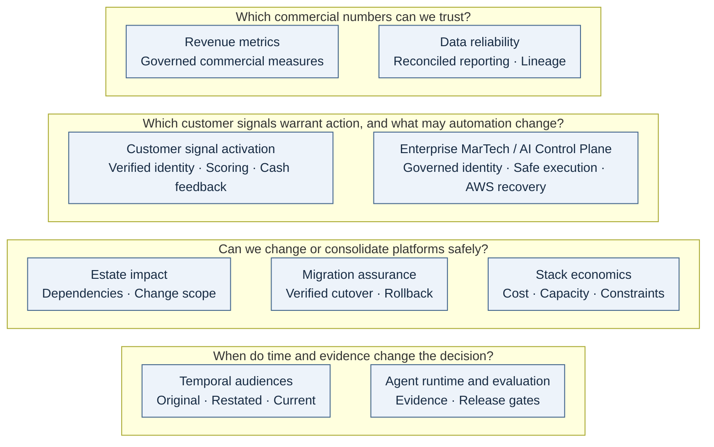

# Richard Butts

**MarTech & Data Architecture · GTM & Revenue Systems · Integration & Migration · AI Systems**

I design and build governed systems across marketing technology, customer data, GTM and revenue operations, analytics, integrations, and AI. My work connects business definitions to technical control: canonical identity, source-of-truth rules, data quality, APIs, migration, reconciliation, and automation that can be trusted when systems disagree or fail.

My background spans enterprise ecommerce, B2B SaaS, and multi-brand operating environments, so I approach architecture from both sides: **how the systems work technically and how they affect acquisition, pipeline, attribution, revenue, and operating decisions.**

### The architecture questions behind the work

```mermaid
---
config:
  flowchart:
    nodeSpacing: 20
    rankSpacing: 20
    padding: 8
    wrappingWidth: 260
  themeVariables:
    fontSize: 14px
---
flowchart TB
  subgraph M[Which commercial numbers can we trust?]
    direction LR
    Q["Revenue metrics<br/>Governed commercial measures"]
    R["Data reliability<br/>Reconciled reporting · Lineage"]
    Q ~~~ R
  end
  subgraph G[Which customer signals warrant action, and what may automation change?]
    direction LR
    S["Customer signal activation<br/>Verified identity · Scoring · Cash feedback"]
    C["Enterprise MarTech / AI Control Plane<br/>Governed identity · Safe execution · AWS recovery"]
    S ~~~ C
  end
  subgraph P[Can we change or consolidate platforms safely?]
    direction LR
    L["Estate impact<br/>Dependencies · Change scope"]
    E["Migration assurance<br/>Verified cutover · Rollback"]
    B["Stack economics<br/>Cost · Capacity · Constraints"]
    L ~~~ E ~~~ B
  end
  subgraph T[When do time and evidence change the decision?]
    direction LR
    F["Temporal audiences<br/>Original · Restated · Current"]
    D["Agent runtime and evaluation<br/>Evidence · Release gates"]
    F ~~~ D
  end
  M ~~~ G ~~~ P ~~~ T
  classDef capability fill:#edf3fa,stroke:#42658c,color:#172b43;
  class Q,R,S,C,L,E,F,D,B capability;
```

*A map of the engineering capabilities demonstrated by the projects below.*

## Selected engineering work

Nine executable engineering projects, each with reproducible evidence and documented operating boundaries.

| Project | Architecture problem | What the implementation demonstrates |
|---|---|---|
| **[Revenue Metrics Platform](https://github.com/rlbsem/revenue-metrics-platform)** | How can Marketing, Sales and Finance use consistent, explainable commercial metrics when pipeline, bookings, invoicing, cash and ARR represent different economic events? | Deterministic synthetic enterprise modeling at approximately $755M period-end ARR, dbt dimensional models with explicit fact grains and SCD2 history, governed commercial metrics, incremental/full-build equivalence, reconciliation, Streamlit and analyst consumption, CI/testing, and a Snowflake-ready execution path. |
| **[Customer Signal & Activation](https://github.com/rlbsem/customer-signal-activation)** | Which customer signals deserve a sales handoff, and can the eventual commercial outcome be traced to allocated cash? | Enterprise B2B browser and call signals, authenticated brand-scoped identity, enrichment authority and conflict handling, explainable fit/intent scoring, consent- and ownership-safe routing, durable CRM activation with uncertain-result recovery, and dbt-validated fulfillment-to-invoice-to-cash attribution and conversion feedback. |
| **[Enterprise MarTech / AI Control Plane](https://github.com/rlbsem/enterprise-martech-ai-control-plane)** | Who owns customer truth, and what may an agent or workflow change? | Customer-state authority and durable execution; Terraform AWS architecture with ECS/Fargate, RDS PostgreSQL and scoped IAM/OIDC; immutable releases and rollback, recovery reconciliation, and validated enterprise workloads. |
| **[MarTech Data Reliability](https://github.com/rlbsem/martech-data-reliability)** | Can Marketing trust reporting when source feeds arrive late, repeat, change schema, or correct prior periods? | Content-addressed ingestion, closed data contracts, quarantine and rejection, revision-aware corrections, cross-grain SQL aggregation, freshness and reference gates, crash recovery, controlled backfills, independent reconciliation, and atomic publication. |
| **[MarTech Migration Assurance](https://github.com/rlbsem/martech-migration-assurance)** | Can we replace a platform without losing meaning or making rollback unsafe? | Consistent snapshots and change catch-up, versioned schema mappings, independent semantic reconciliation, evidence-bound cutover, process-crash recovery, reverse migration, and explicit rollback blockers. |
| **[Temporal Customer Audiences](https://github.com/rlbsem/temporal-customer-audiences)** | Who belonged in an audience at a given time, based on what we knew then? | Bitemporal customer facts, immutable original and restated audience decisions, time-driven expiry, selective reevaluation, coverage-gated activation, and destination reconciliation. |
| **[Enterprise Agent Runtime & Evaluation](https://github.com/rlbsem/enterprise-agent-runtime-evaluation)** | How do we evaluate an agent and govern release rather than trusting its output? | Actual local LLM inference, evidence-grounded tool decisions, adversarial tests, regression gates, shadow/canary evaluation, observable rollback, and transparent reporting of failed model behavior. |
| **[MarTech Estate Impact](https://github.com/rlbsem/martech-estate-impact)** | Before we retire or replace a marketing platform, what actually depends on it? | Evidence-backed estate reconstruction, provenance and conflict handling, typed dependencies, three-state impact analysis, counterfactual retirement/replacement, witness paths, and prerequisite sequencing across a synthetic 24-system estate. |
| **[MarTech Stack Economics](https://github.com/rlbsem/martech-stack-economics)** | How do we reduce integration cost without breaking freshness, capacity, or data requirements? | Mixed-integer configuration planning across shared fees, partial batches, API quotas, regional and capability constraints, and demand spikes. An independent accountant checks the solution; exhaustive enumeration confirms the optimum across 3,125 synthetic configurations. |

**Start with the problem closest to your team:** [commercial metrics and analytics engineering](https://github.com/rlbsem/revenue-metrics-platform), [customer signals and activation](https://github.com/rlbsem/customer-signal-activation), [AI governance and controlled execution](https://github.com/rlbsem/enterprise-martech-ai-control-plane), [data reliability and reconciliation](https://github.com/rlbsem/martech-data-reliability), [platform migrations](https://github.com/rlbsem/martech-migration-assurance), [customer data and audience correctness](https://github.com/rlbsem/temporal-customer-audiences), [agent testing and release](https://github.com/rlbsem/enterprise-agent-runtime-evaluation), [estate discovery and change impact](https://github.com/rlbsem/martech-estate-impact), [stack optimization and cost](https://github.com/rlbsem/martech-stack-economics).

## Professional context

My background spans enterprise ecommerce, B2B SaaS, **MarTech and data architecture, GTM and revenue systems, analytics, and enterprise integration** across **Lorex Technology, LMN (Landscape Management Network), and Groundbreakers Digital**.

- **Enterprise ecommerce and commercial scale:** Managed more than **$65M in paid media and marketing investment** across my career. At Lorex, annual ecommerce revenue grew from approximately **$55M to $101M during my tenure**, while my work expanded across acquisition, attribution, web analytics, ecommerce, executive reporting, and enterprise marketing systems.
- **B2B SaaS and GTM systems:** At LMN, managed acquisition and performance analysis across an approximately **$350K/month multi-product program**, with CAC improvements of approximately **15–25%**. The environment included Salesforce, Pardot, Salesforce Marketing Cloud, GA/GA4, GTM, pipeline measurement, and recurring executive product reporting.
- **Data architecture and systems delivery:** Founded Groundbreakers Digital and led architecture and systems delivery across roughly **30 projects** for founder-owned and private-equity-backed businesses. The work spans canonical customer identity, source-of-truth governance, attribution, CRM and operating-system integration, finance/revenue reconciliation, APIs and webhooks, ETL/ELT, stateful middleware, idempotency, retry and exception handling, audit logging, multi-brand data architecture, and AI-driven workflows.
- **AI and automation:** Working with LLMs and AI systems since **2023**, building on longer-standing experience in marketing automation, analytics, integration, customer data, and governed workflow design.

**Professional systems and platforms:** Salesforce · HubSpot · Pardot · Salesforce Marketing Cloud · Marketo · Segment · Clay · Snowflake · GA4 / GTM · Adobe Analytics · Tableau · PostgreSQL · Supabase · QuickBooks Online · REST APIs · webhooks · ETL / ELT · Make · n8n · Workato · Zapier

**Technologies demonstrated in the public engineering work:** Python · SQL · dbt Core · PostgreSQL · DuckDB · SQLite · Streamlit · FastAPI · Airflow · SciPy / HiGHS · Docker · GitHub Actions · Terraform · AWS (ECS/Fargate, RDS, ECR, Secrets Manager, CloudWatch, IAM/OIDC) · HTTP / REST · local LLM inference

## How to review the work

Each repository has a runnable entry point, documented architecture and assumptions, tests, generated evidence, and explicit limitations. Start with the executed results, then inspect the design and validation records.

The underlying theme is straightforward: **tools execute; the control layer determines what is allowed to become true.**

[GitHub profile](https://github.com/rlbsem) · **Groundbreakers Digital:** Data Infrastructure · Revenue Integrity · M&A Systems Architecture
