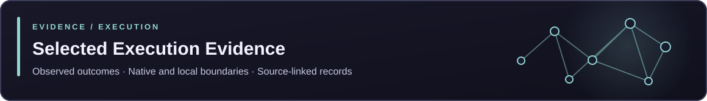
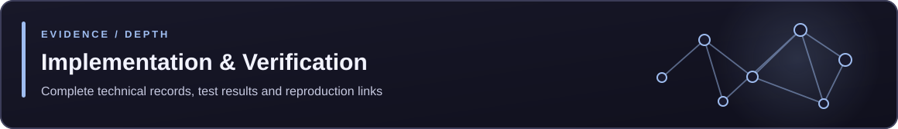

# Richard Butts

**Data & Analytics Engineering | MarTech | GTM & AI Systems | Enterprise Integration | Revenue Integrity**

I build **enterprise data, analytics, MarTech/GTM, integration, and AI systems** across B2B SaaS, enterprise ecommerce, private equity firms, and their portfolio companies.

My work includes **enterprise systems architecture and repeated deployments across private equity investment platforms and their operating businesses**, connecting acquired companies through governed data infrastructure, CRM and financial systems integration, stateful middleware, revenue reconciliation, and consolidated portfolio reporting.

**Engineering evidence:** Working Python, SQL, PostgreSQL, dbt and API implementations, executed AWS RDS recovery, native Salesforce/Snowflake/BigQuery integrations and local LLM inference. Public demonstrations use synthetic or public sample data to protect confidential client information; native executions and simulated vendor contracts are documented separately.

## Featured engineering proof

**AWS application recovery, verified October 2026.** Built and exercised a Python/PostgreSQL control plane on AWS using two sequential RDS point-in-time restores. The first recovery exposed **3 restored intents versus 5 independent effects** and correctly blocked execution. The later restore enforced fresh authorization and consent, rejected stale worker completion, and independently verified **6 matching intents/effects with zero duplicates**. The experiment ran synthetic, one-off Fargate tasks; full production ECS/HTTPS/Multi-AZ acceptance was outside scope.

[**Inspect executed AWS recovery evidence**](https://github.com/rlbsem/enterprise-martech-ai-control-plane/blob/main/docs/evidence/cloud-recovery/native-application-2026-10-28/README.md) · [Source repository](https://github.com/rlbsem/enterprise-martech-ai-control-plane)

## Architecture & Engineering Portfolio

**Interactive Engineering Evidence Lab:** [Explore twelve browser-based engineering investigations](https://rlbsem.github.io/enterprise-revenue-systems-lab/) with recorded decisions, source records, failures and verification evidence. [Lab source code](https://github.com/rlbsem/enterprise-revenue-systems-lab).

## Engineering implementations

**13 engineering implementations across four technical disciplines.** Each project presents the problem, implementation, verification, and links to the source code and execution evidence.

## Data, Analytics & MarTech Engineering

SQL and dbt modeling, GA4 and conversion integrity, CDC migration, reliable source ingestion, and temporal data correctness.

<table>
<tr><td valign="top" width="50%">
<strong><a href="https://github.com/rlbsem/revenue-metrics-platform">Revenue Metrics Platform</a></strong>

<strong>Challenge:</strong> Sales, finance, and leadership use different definitions for pipeline, bookings, invoices, cash, and ARR, so their reports often disagree.

<strong>Implementation:</strong> Models these measures at their correct grain using SQL and dbt. Traces variances to source records and tests correctness and performance across substantial synthetic datasets.

<strong>Verification:</strong> 15 SQL/dbt models; 87 Python and 30 dbt tests; measured synthetic-scale parity.

<a href="https://rlbsem.github.io/enterprise-revenue-systems-lab/?case=analytics-engineering">Inspect SQL, lineage, and benchmarks</a> | <a href="https://github.com/rlbsem/revenue-metrics-platform">Repository</a>
</td><td valign="top" width="50%">
<strong><a href="https://github.com/rlbsem/first-party-measurement-assurance">First-Party Measurement Assurance</a></strong>

<strong>Challenge:</strong> Marketing can report a full contract as a purchase, miss real payments, or count repeated events as new conversions.

<strong>Implementation:</strong> Connects consent-aware browser events with authoritative signed-contract and payment records. Reconciles conversion values with SQL/dbt and includes separate native BigQuery public-sample evidence.

<strong>Verification:</strong> Native BigQuery GA4 sample: 14 purchases, 57 item rows, and unresolved differences.

<a href="https://rlbsem.github.io/enterprise-revenue-systems-lab/?case=measurement-integrity">Explore conversion discrepancies</a> | <a href="https://github.com/rlbsem/first-party-measurement-assurance">Repository</a>
</td></tr>
<tr><td valign="top" width="50%">
<strong><a href="https://github.com/rlbsem/martech-migration-assurance">MarTech Migration Assurance</a></strong>

<strong>Challenge:</strong> Moving customer data to a new platform can miss updates or silently change the meaning of fields even when row counts match.

<strong>Implementation:</strong> Uses native PostgreSQL snapshot and WAL change capture, semantic comparisons, checkpoints, and guarded cutover and rollback decisions to find unsafe migrations.

<strong>Verification:</strong> Native PostgreSQL CDC with 13 executed fault scenarios and guarded cutover.

<a href="https://github.com/rlbsem/martech-migration-assurance/blob/main/docs/evidence/postgres-cdc/report.md">See native CDC recovery evidence</a> | <a href="https://github.com/rlbsem/martech-migration-assurance">Repository</a>
</td><td valign="top" width="50%">
<strong><a href="https://github.com/rlbsem/martech-data-reliability">MarTech Data Reliability</a></strong>

<strong>Challenge:</strong> Late, duplicated, incomplete or unavailable marketing and CRM source feeds can produce plausible reports with incorrect totals and unverifiable lineage.

<strong>Implementation:</strong> Integrates three independently persisted synthetic HTTP sources through durable checkpoints, contract and coverage gates, exact acknowledgment recovery, DuckDB publication and independent reconciliation. An executable operations console exposes blocked candidates and source evidence.

<strong>Verification:</strong> Three independent local HTTP sources, durable checkpoints, and reconciliation.

<a href="https://github.com/rlbsem/martech-data-reliability/blob/main/docs/evidence/operations/README.md">Inspect native HTTP and reliability evidence</a> | <a href="https://github.com/rlbsem/martech-data-reliability/blob/main/docs/evidence/report.md">Original warehouse proof</a> | <a href="https://github.com/rlbsem/martech-data-reliability">Repository</a>
</td></tr>
<tr><td valign="top" width="50%">
<strong><a href="https://github.com/rlbsem/temporal-customer-audiences">Temporal Customer Audiences</a></strong>

<strong>Challenge:</strong> Late customer events can change historical audiences. Permission withdrawal, failed handoffs and lost acknowledgments also make current activation unsafe without independent verification.

<strong>Implementation:</strong> Preserves business-time and knowledge-time decisions, then governs brand-scoped activation using a PostgreSQL journal, current permission checks, exact approval, durable outbox and independent HTTP receipts. Tested worker termination, retries and destination reconciliation.

<strong>Verification:</strong> PostgreSQL activation journal, current permission gates, and independent HTTP receipts.

<a href="https://github.com/rlbsem/temporal-customer-audiences/blob/main/docs/evidence/activation-assurance/README.md">See PostgreSQL, HTTP and recovery proof</a> | <a href="https://github.com/rlbsem/temporal-customer-audiences/blob/main/docs/evidence/report.md">Historical decision evidence</a> | <a href="https://github.com/rlbsem/temporal-customer-audiences">Repository</a>
</td><td valign="top" width="50%"></td></tr>
</table>

## GTM, CRM & AI Systems

Customer and account intelligence, governed CRM execution, stateful integration, and evidence-based AI release controls.

<table>
<tr><td valign="top" width="50%">
<strong><a href="https://github.com/rlbsem/customer-signal-activation">Customer Signal &amp; Activation</a></strong>

<strong>Challenge:</strong> Customer activity, CRM ownership, and lifecycle messages live in different systems. That can create duplicate outreach, bad handoffs, and unreliable attribution.

<strong>Implementation:</strong> Resolves customer identity and permissions, coordinates the next action, and reconciles CRM feedback. Includes a separately executed Salesforce and Snowflake round trip.

<strong>Verification:</strong> Native Salesforce/Snowflake readback plus 443 local tests and lifecycle safeguards.

<a href="https://github.com/rlbsem/customer-signal-activation/blob/main/docs/evidence/connected-integration/README.md">See native integration proof</a> | <a href="https://github.com/rlbsem/customer-signal-activation">Repository</a>
</td><td valign="top" width="50%">
<strong><a href="https://github.com/rlbsem/gtm-pipeline-orchestration">GTM Pipeline Orchestration</a></strong>

<strong>Challenge:</strong> Sales teams receive scattered buying signals and AI research but still lack a reliable way to decide who to contact and who owns the follow-up.

<strong>Implementation:</strong> Combines evidence-based account prioritization, reviewed AI suggestions, CRM routing, and outcome tracking. A separate native Salesforce run verifies one guarded SDR Task.

<strong>Verification:</strong> 237 tests; actual Qwen3 evaluation and separately recorded native Salesforce Task.

<a href="https://rlbsem.github.io/enterprise-revenue-systems-lab/?case=gtm-research">Try the account intelligence case</a> | <a href="https://github.com/rlbsem/gtm-pipeline-orchestration">Repository</a>
</td></tr>
<tr><td valign="top" width="50%">
<strong><a href="https://github.com/rlbsem/enterprise-martech-ai-control-plane">Enterprise MarTech / AI Control Plane</a></strong>

<strong>Challenge:</strong> When CRM, marketing, and finance systems disagree, ordinary sync jobs can overwrite the right data or repeat an action after a timeout.

<strong>Implementation:</strong> Implements a PostgreSQL control layer for canonical identities, field ownership, consent, durable delivery, and receipt-based recovery. Includes measured overload and isolation tests.

<strong>Verification:</strong> Executed AWS recovery: two RDS point-in-time restores; 3/5 discrepancy blocked, followed by 6/6 reconciliation with zero duplicate effects. Separate synthetic load tests reconciled 12,035 actions.

<a href="https://github.com/rlbsem/enterprise-martech-ai-control-plane/blob/main/docs/evidence/cloud-recovery/native-application-2026-10-28/README.md">AWS recovery evidence</a> | <a href="https://github.com/rlbsem/enterprise-martech-ai-control-plane/blob/main/docs/evidence/dependency-isolation/arrival-review/README.md">Load and failure evidence</a> | <a href="https://github.com/rlbsem/enterprise-martech-ai-control-plane">Repository</a>
</td><td valign="top" width="50%">
<strong><a href="https://github.com/rlbsem/enterprise-agent-runtime-evaluation">Enterprise Agent Runtime &amp; Evaluation</a></strong>

<strong>Challenge:</strong> An agent can appear to work in a demo but make unsupported claims, repeat actions, or regress after a model update.

<strong>Implementation:</strong> Tests actual local Qwen3 responses against evidence and action rules, then exercises shadow evaluation, canary release, promotion, and verified rollback after a controlled failure.

<strong>Verification:</strong> Actual Qwen3 release: 48/48 tasks per configuration and tested rollback.

<a href="https://rlbsem.github.io/enterprise-revenue-systems-lab/?case=release-assurance">Inspect the AI release decisions</a> | <a href="https://github.com/rlbsem/enterprise-agent-runtime-evaluation">Repository</a>
</td></tr>
</table>

## Enterprise Integration & Revenue Integrity

Durable order-to-cash reconciliation and controlled multi-business integration, including acquisition-specific governance.

<table>
<tr><td valign="top" width="50%">
<strong><a href="https://github.com/rlbsem/enterprise-revenue-integrity-platform">Enterprise Revenue Integrity Platform</a></strong>

<strong>Challenge:</strong> A closed deal, an invoice, an ERP posting, and collected cash are not the same number. Disconnected systems can conceal the difference.

<strong>Implementation:</strong> Tracks source-owned financial events across the order-to-cash process, reconciles records with dbt, and safely recovers uncertain writes. The synthetic $1,500 ERP variance remains visible.

<strong>Verification:</strong> Unresolved synthetic $1,500 ERP variance retained after verified recovery.

<a href="https://rlbsem.github.io/enterprise-revenue-systems-lab/?case=revenue-integrity">Explore the reconciliation</a> | <a href="https://github.com/rlbsem/enterprise-revenue-integrity-platform">Repository</a>
</td><td valign="top" width="50%">
<strong><a href="https://github.com/rlbsem/enterprise-acquisition-onboarding">Enterprise Acquisition Onboarding</a></strong>

<strong>Challenge:</strong> Combining acquired businesses can merge unrelated customers, lose local meaning, and produce consolidated reports before the source data is trustworthy.

<strong>Implementation:</strong> Enforces legal-entity identity, reviewed mappings, admission checks, and versioned finance reporting. A runnable three-company synthetic scenario exposes reporting exclusions and unresolved exceptions.

<strong>Verification:</strong> Three-company synthetic financial reconciliation; 83 regression tests.

<a href="https://github.com/rlbsem/enterprise-acquisition-onboarding/blob/main/docs/annual-scenario.md">Inspect financial governance</a> | <a href="https://github.com/rlbsem/enterprise-acquisition-onboarding">Repository</a>
</td></tr>
</table>

## Platform Governance & Optimization

Defensible technology decisions with explicit dependency, cost, reliability, and capacity constraints.

<table>
<tr><td valign="top" width="50%">
<strong><a href="https://github.com/rlbsem/martech-estate-impact">MarTech Estate Impact</a></strong>

<strong>Challenge:</strong> Retiring or consolidating platforms can break hidden dependencies across operating companies and shared enterprise services. Incomplete evidence cannot justify a safe change.

<strong>Implementation:</strong> Combines PostgreSQL-backed dependency evaluation with a multi-company review console, immutable change proposals, scoped approvals and fail-closed readiness gates. Independently checks impacts across six change classes.

<strong>Verification:</strong> 112 independent requirement outcomes and 144 browser checks.

<a href="https://github.com/rlbsem/martech-estate-impact/blob/main/docs/evidence/change-assurance/README.md">See the governed change review and tests</a> | <a href="https://github.com/rlbsem/martech-estate-impact/blob/main/docs/evidence/report.md">Original dependency proof</a> | <a href="https://github.com/rlbsem/martech-estate-impact">Repository</a>
</td><td valign="top" width="50%">
<strong><a href="https://github.com/rlbsem/martech-stack-economics">MarTech Stack Economics</a></strong>

<strong>Challenge:</strong> The cheapest automation stack on paper can break under campaign spikes, API quotas, data freshness requirements, or processing constraints.

<strong>Implementation:</strong> Finds the lowest-cost feasible integration configuration across those constraints and independently checks the selected solution against rejected alternatives.

<strong>Verification:</strong> Constraint-aware cost/capacity evaluation against rejected alternatives.

<a href="https://github.com/rlbsem/martech-stack-economics/blob/main/docs/evidence/report.md">Inspect the cost and capacity tradeoffs</a> | <a href="https://github.com/rlbsem/martech-stack-economics">Repository</a>
</td></tr>
</table>

## Selected execution evidence

Executed outcomes and independently checkable records. Each case identifies what was tested, what was observed and the limits of that evidence.

<table>
<tr>
<td width="50%" valign="top">
<strong>Enterprise change assurance</strong> Actual local PostgreSQL console; multi-company dependencies and review gates.
</td>
<td width="50%" valign="top">
<strong>AI release and rollback</strong> Actual local model evaluation evidence viewer with preserved failures.
</td>
</tr>
</table>

*Actual local screenshots from documented synthetic workflows; not production deployments or native vendor-console captures.*

### [Salesforce and Snowflake: recover an uncertain CRM write](https://github.com/rlbsem/customer-signal-activation/blob/main/docs/evidence/connected-integration/README.md)

What if Salesforce saves an approved action but the response is lost? In a recorded connected Salesforce Developer Edition and Snowflake run, the dispatcher recovered the existing receipt rather than creating a duplicate. An independent reader verified the record, and CRM feedback changed the warehouse recommendation from `clarify_need` to `hold`. This demonstrates controlled CRM execution and warehouse feedback, not customer outreach or a sale.

### [BigQuery: distinguish GA4 purchases from item rows](https://github.com/rlbsem/first-party-measurement-assurance/blob/main/docs/evidence/google-bigquery/README.md)

Native GoogleSQL ran against Google's public, obfuscated GA4 ecommerce sample. The queries found **14 purchase events, 57 nested item rows, 13 distinct transaction IDs, and two unresolved item/revenue differences**. This exposes the reporting error caused by counting unnested items as purchases. The native sample is separate from the synthetic contract and payment reconciliation; it is not proof of live GA4 ingestion.

### [PostgreSQL CDC: migrate without silently corrupting customer state](https://github.com/rlbsem/martech-migration-assurance/blob/main/docs/evidence/postgres-cdc/report.md)

Native `pgoutput` capture bridges a consistent snapshot to subsequent WAL changes. Thirteen executed fault scenarios cover cutover, process termination, lost acknowledgments and unsafe checkpoint or schema states. An equal-row-count migration still fails when an unknown subscription value becomes false. Unsupported recovery paths stay blocked instead of being declared successful.

### [Qwen3 model release: evaluate, promote, and roll back](https://github.com/rlbsem/enterprise-agent-runtime-evaluation/blob/main/docs/live-release-acceptance.md)

Actual local Qwen3-14B inference tested whether an account-risk agent could make evidence-supported decisions and safe authorized actions. An earlier candidate was rejected at **35/36**; a later bounded-reasoning release passed **48/48 synthetic tasks per configuration** and completed local shadow, read-only canary, promotion and fault-triggered rollback. The results are finite test evidence, not production certification.

### [Financial reporting: respect acquisition boundaries and revisions](https://github.com/rlbsem/enterprise-acquisition-onboarding/blob/main/docs/annual-scenario.md)

A runnable synthetic three-company scenario demonstrates why identical local IDs, pre-acquisition records and held businesses cannot automatically enter consolidated reporting. PostgreSQL/dbt publications preserve original and restated values. The annual report shows **$20.01M to $20.06M in consolidated net invoicing** and retains separate **$25K posting** and **$40K unsupported intercompany** findings. These are synthetic accounting inputs, not recognized revenue or client results.

### [SQL/dbt performance: measure correctness before claiming an optimization](https://github.com/rlbsem/revenue-metrics-platform/blob/main/docs/performance.md)

The Revenue Metrics Platform models bookings, invoices, cash and ARR at their own grains across **15 SQL/dbt models**. Controlled local enterprise and stress benchmarks compare complete output rowsets with an independent full build. A proposed selective rebuild was rejected after end-to-end measurement showed it was slower, despite reducing some work. Native Snowflake fixture acceptance is documented separately from the large local benchmarks.

### [Control-plane workload: isolate failing destinations and expose rate limits](https://github.com/rlbsem/enterprise-martech-ai-control-plane/blob/main/docs/evidence/dependency-isolation/arrival-review/README.md)

PostgreSQL-governed permits, bounded queues and durable receiver receipts were tested under substantial synthetic load. Across four recorded runs, **12,035 admitted actions** reconciled to single effects while **7,965 overload rejections** were accounted for. Independent receiver analysis also found some one-second arrival buckets with **11 requests** despite a ten-per-window permit contract. The system records that boundary rather than falsely claiming strict downstream arrival-rate compliance.

### [AWS RDS recovery: block unsafe replay, then verify safe resumption](https://github.com/rlbsem/enterprise-martech-ai-control-plane/blob/main/docs/evidence/cloud-recovery/native-application-2026-10-28/README.md)

Executed one bounded AWS acceptance experiment with two sequential retained-backup PostgreSQL point-in-time restores. The first recovery point exposed **3 restored intents versus 5 independent receipts** and correctly kept execution blocked. The later recovery point required fresh proof, rejected stale worker completion, enforced consent and finished with **6 matching intents/effects and zero duplicates**, independently verified. These were synthetic one-off Fargate application tasks, not a production ECS/HTTPS/Multi-AZ deployment; pending AWS deletions and final billing limits remain documented.

## Explore engineering in action

**[Enterprise Revenue Systems Lab](https://rlbsem.github.io/enterprise-revenue-systems-lab/): interactive evidence explorer** · [Source code](https://github.com/rlbsem/enterprise-revenue-systems-lab)

Twelve read-only investigations let you inspect recorded execution, decisions and outcomes directly in the browser:

*Recorded Lab screenshot. The hosted experience is read-only; execution and model inference are evidenced separately.*

- **AI model release assurance:** [Explore the recorded Qwen3 release progression](https://rlbsem.github.io/enterprise-revenue-systems-lab/?case=release-assurance): original Qwen2.5 failures, rejected 35/36 candidate, paired 48/48 finite-suite acceptance, actual local shadow/canary/promotion and controlled-fault rollback. Inspect pinned model traces, independent receipts and evidence limitations; all effects are synthetic.
- **AI seller decisions:** Examine a model-generated recommendation, its supporting sources, a reviewed edit, approval and recorded delivery evidence.
- **Execution recovery:** Trace a lost acknowledgment and worker interruption through durable workflow state and independent receiver receipts, including duplicate prevention.
- **Revenue reconciliation:** Explore why installed ARR, bookings, invoices and collected cash differ, with a source-backed financial bridge.
- **First-party measurement integrity:** [Explore the measurement investigation](https://rlbsem.github.io/enterprise-revenue-systems-lab/?case=measurement-integrity): inspect consent-aware browser events, offline contract/payment authority, synthetic conversion discrepancies, real local dbt model rowsets and separately recorded native BigQuery GA4 sample results. The hosted investigation is read-only.
- **Analytics engineering model correctness and performance:** [Inspect the interactive investigation](https://rlbsem.github.io/enterprise-revenue-systems-lab/?case=analytics-engineering) covering 15 SQL/dbt models, source grain and lineage, an executed fixture, paired synthetic-scale performance tests and a rejected selective rebuild that increased total elapsed time. Historical native Snowflake fixture evidence is identified separately.
- **Order-to-cash revenue integrity:** [Explore the revenue integrity investigation](https://rlbsem.github.io/enterprise-revenue-systems-lab/?case=revenue-integrity), covering CRM-to-billing-to-ERP source lineage, verified operator recovery and a still-open synthetic $1,500 financial variance. The hosted case is read-only and cites the underlying recorded local evidence.
- **Native Salesforce and Snowflake:** [Inspect the CRM-to-warehouse round trip](https://rlbsem.github.io/enterprise-revenue-systems-lab/?case=connected-roundtrip), including source authority, lost-acknowledgment recovery, independent CRM readback and the resulting warehouse decision.
- **AI account intelligence to qualified pipeline:** [Explore the hosted SDR Account Intelligence investigation](https://rlbsem.github.io/enterprise-revenue-systems-lab/?case=gtm-research): six synthetic research accounts, 40 recorded Qwen3 responses, evidence-grounded recommendations, rejected outputs and saved local seller-review proof. [Explore the separate pipeline investigation](https://rlbsem.github.io/enterprise-revenue-systems-lab/?case=gtm-enterprise) for synthetic opportunity measurement and earlier native Salesforce evidence. The richer research did not execute through Salesforce; the separate connected Qwen3-to-Salesforce Task proof remains in the [source GTM repository](https://github.com/rlbsem/gtm-pipeline-orchestration/blob/main/docs/connected-sdr.md).

### Enterprise architecture and data assurance

Three new investigations expose actual local synthetic execution evidence through the published read-only Lab. Open any investigation directly, including the recorded exception states.

<table>
<tr><td valign="top" width="38%"></td><td valign="top"><strong><a href="https://rlbsem.github.io/enterprise-revenue-systems-lab/?case=estate-assurance">Enterprise Change Assurance</a></strong>
Explore company-scoped dependencies, proposal revisions, reviewer decisions and unresolved evidence before technology retirement. The recorded synthetic estate contains four company scopes and 112 independently checked requirement outcomes.

<a href="https://github.com/rlbsem/enterprise-revenue-systems-lab/blob/bad6887f4ec2e0dac5a1ddeeadeda7c51d5c4a96/docs/architecture-assurance.md#enterprise-change-assurance">Execution boundaries and source evidence</a>
</td></tr>
<tr><td valign="top" width="38%"></td><td valign="top"><strong><a href="https://rlbsem.github.io/enterprise-revenue-systems-lab/?case=reliability-operations">MarTech Data Reliability</a></strong>
Trace independent local HTTP feeds through source bytes, checkpoints, rejected publications and reconciled results. Investigate why an equal-row-count report with an incorrect value was blocked.

<a href="https://github.com/rlbsem/enterprise-revenue-systems-lab/blob/bad6887f4ec2e0dac5a1ddeeadeda7c51d5c4a96/docs/architecture-assurance.md#martech-data-reliability">Execution boundaries and source evidence</a>
</td></tr>
<tr><td valign="top" width="38%"></td><td valign="top"><strong><a href="https://rlbsem.github.io/enterprise-revenue-systems-lab/?case=temporal-assurance">Temporal Audience Assurance</a></strong>
Compare original and restated history, present permission checks, lost acknowledgments and independent destination receipts. A historic receipt never authorizes a new action.

<a href="https://github.com/rlbsem/enterprise-revenue-systems-lab/blob/bad6887f4ec2e0dac5a1ddeeadeda7c51d5c4a96/docs/architecture-assurance.md#temporal-audience-assurance">Execution boundaries and source evidence</a>
</td></tr>
</table>

*These views inspect recorded local synthetic execution. They do not execute source systems, call vendors or activate customer audiences.*

The hosted lab makes recorded synthetic execution evidence instantly inspectable; linked repositories provide reproducible workflows and fresh-inference procedures.

## Implementation details and verification

Detailed implementation records, measured results, tests, and documentation for the engineering systems above.

*Expand any project to read its complete original implementation details, measurements, and verification links.*

<strong>Revenue Metrics Platform</strong>: SQL/dbt parity, Snowflake evidence and synthetic-scale performance

### [Revenue Metrics Platform](https://github.com/rlbsem/revenue-metrics-platform)

**Business impact:** Give investors, CFOs and operating leaders defensible sold, billed and collected figures, with source-linked variance explanations instead of conflicting CRM and finance reports. Bookings, invoices, collected cash and period-end ARR retain separate grains. This Python/SQL/dbt platform reconciles six governed measures across historical CRM, subscription and financial events. **Controlled local enterprise and stress benchmarks** executed at 60,000 and 180,000 synthetic accounts, including a **37.38-million-row** opportunity-day fact. **87 Python tests, 30 dbt tests and complete content comparisons across all 15 models** verified financial parity. End-to-end benchmarking rejected a slower selective-rebuild candidate and retained the faster default. Historical native Snowflake fixture acceptance and larger local stress results are separately linked.

[Interactive Analytics Engineering investigation](https://rlbsem.github.io/enterprise-revenue-systems-lab/?case=analytics-engineering) · [Measured performance and parity report](https://github.com/rlbsem/revenue-metrics-platform/blob/main/docs/evidence/performance/report.md) · [Reproduction and implementation limits](https://github.com/rlbsem/revenue-metrics-platform/blob/main/docs/performance.md) · [Historical Snowflake execution evidence](https://github.com/rlbsem/revenue-metrics-platform/blob/main/docs/evidence/snowflake/fixture/README.md)

<strong>First-Party Measurement Assurance</strong>: Native BigQuery sample and GA4 conversion reconciliation

### [First-Party Measurement Assurance](https://github.com/rlbsem/first-party-measurement-assurance)

**Business impact:** Recover missing conversion signals, expose overstated purchase values and connect marketing attribution to actual contracts and collections. This implementation combines consent-aware events, GTM data layers, durable offline conversion receipts and SQL/dbt reconciliation. **Native BigQuery queries** against Google's public GA4 sample distinguished 14 purchase events from 57 nested item rows and retained two revenue discrepancies. The Google sample and local synthetic business scenarios are documented separately.

A separate [local GA4 warehouse module](https://github.com/rlbsem/first-party-measurement-assurance/blob/main/docs/evidence/ga4-warehouse/README.md) verifies late corrections, replay safety and incremental/full-refresh parity.

[Interactive first-party measurement investigation](https://rlbsem.github.io/enterprise-revenue-systems-lab/?case=measurement-integrity) · [BigQuery execution evidence](https://github.com/rlbsem/first-party-measurement-assurance/blob/main/docs/evidence/google-bigquery/README.md) · [Measurement verification (main)](https://github.com/rlbsem/first-party-measurement-assurance/actions/workflows/verify.yml?query=branch%3Amain)

<strong>GTM Pipeline Orchestration</strong>: Qwen3 research, Salesforce Task, routing and pipeline verification

### [GTM Pipeline Orchestration](https://github.com/rlbsem/gtm-pipeline-orchestration)

**Business impact:** Give revenue teams evidence-backed account priorities, accountable owner handoffs and traceable qualified pipeline. This Python GTM application covers AI account research, fit/intent prioritization, inbound owner-routing, approved seller actions, failure recovery and qualified-pipeline measurement. The **SDR account-intelligence desk** exposes dated source evidence, explainable account priorities, conflicting fixture enrichment, editable outreach openings and durable local approvals/dismissals. It retains **40 actual Qwen3-14B evaluation responses across three prompt approaches**, including preserved failures, plus a separate fresh source-to-inference-to-local-approval demonstration. The latest verification reports **237 passing tests** and Linux, Windows and container CI.

A **separate connected native Salesforce Developer Edition run** took a synthetic buying signal through **fresh Qwen3 inference → exact operator review → one guarded internal Salesforce SDR Task → independent readback**, including lost-acknowledgment recovery. The research desk's approvals are local; native Salesforce Task execution is evidenced separately. Clay enrichment uses fixture providers, while n8n is a documented reference workflow. The **120-account, synthetic USD $3.46M accepted-opportunity scenario** demonstrates source-to-pipeline measurement and independently inspectable qualification logic.

[Research architecture and evaluation](https://github.com/rlbsem/gtm-pipeline-orchestration/blob/main/docs/account-intelligence.md) · [Recorded Qwen3 evaluations](https://github.com/rlbsem/gtm-pipeline-orchestration/blob/main/docs/evidence/research/README.md) · [Fresh operator proof](https://github.com/rlbsem/gtm-pipeline-orchestration/blob/main/docs/evidence/research/operator-proof.json) · [Connected native Salesforce execution](https://github.com/rlbsem/gtm-pipeline-orchestration/blob/main/docs/connected-sdr.md) · [Native Task and recovery evidence](https://github.com/rlbsem/gtm-pipeline-orchestration/blob/main/docs/evidence/connected/README.md) · [Synthetic pipeline demo](https://github.com/rlbsem/gtm-pipeline-orchestration/blob/main/docs/evidence/enterprise-usd/README.md) · [GTM verification (main)](https://github.com/rlbsem/gtm-pipeline-orchestration/actions/workflows/verify.yml?query=branch%3Amain)

<strong>Customer Signal & Activation</strong>: CRM/warehouse recovery, lifecycle measurement and experiments

### [Customer Signal & Activation](https://github.com/rlbsem/customer-signal-activation)

**Business impact:** Connect customer intelligence to permission-aware follow-up, accountable CRM ownership and verifiable commercial outcomes instead of fragmented journeys. This Python/SQL platform connects customer signals to governed CRM decisions, preserving identity, person-level permissions, account ownership, approved actions and fulfillment-to-cash lineage. In an **executed Salesforce ↔ Snowflake round-trip**, it recovered an uncertain Salesforce acknowledgment without duplicating the record; independent readback confirmed the action, and CRM feedback changed the subsequent warehouse recommendation.

Its **lifecycle orchestration and experimentation layer** now coordinates trial onboarding, quiet-trial assistance and expansion education with durable timers, cross-journey contact arbitration, enforced treatment/holdout assignments, late-correction-safe metrics and independent HTTP receipt recovery. The implementation verifies **443 tests across the completed local suite**, with successful Linux/Windows CI, **nine dbt models and 13 data tests**. Its executed synthetic experiments demonstrate contact arbitration, treatment/holdout measurement and traceable follow-up outcomes, with safeguards against duplicate or unauthorized actions.

[Lifecycle architecture and executed proof](https://github.com/rlbsem/customer-signal-activation/blob/main/docs/lifecycle-execution-evidence.md) · [Experiment measurement contract](https://github.com/rlbsem/customer-signal-activation/blob/main/docs/lifecycle-experiments.md) · [Native Salesforce/Snowflake evidence](https://github.com/rlbsem/customer-signal-activation/blob/main/docs/evidence/connected-integration/README.md) · [Salesforce authorization and recovery tests](https://github.com/rlbsem/customer-signal-activation/blob/main/docs/evidence/salesforce-native/README.md)

<strong>Enterprise MarTech / AI Control Plane</strong>: Native AWS recovery, source authority, durable receipts and fault isolation

### [Enterprise MarTech / AI Control Plane](https://github.com/rlbsem/enterprise-martech-ai-control-plane)

**Business impact:** Let private equity sponsors and multi-brand operators govern data movement across acquired companies without manually reconciling disconnected operating systems. This Python/PostgreSQL control plane governs canonical identity, field ownership, consent, approvals and durable downstream actions. Its **dependency-isolation acceptance** offered 20,000 synthetic proposals across four five-minute local HTTP runs: **12,035 admitted actions** each reconciled to one effect, while **7,965 overload rejections** were explicitly accounted for. PostgreSQL-coordinated destination permits, bounded queues and recovery checks kept an unhealthy receiver from monopolizing shared workers. Permit issuance met its declared window contract; independent arrival analysis also identified bursts of 11 requests, valuable evidence for stricter provider-specific rate controls. **Native AWS application recovery passed** in a separate bounded synthetic test: two sequential RDS point-in-time restores, a blocked 3/5 discrepancy, and safe resumption after fresh evidence with 6/6 independent reconciliation and no duplicate effects. This is execution evidence for isolated tasks, not a full production ECS/HTTPS/Multi-AZ deployment.

[Executed AWS recovery acceptance](https://github.com/rlbsem/enterprise-martech-ai-control-plane/blob/main/docs/evidence/cloud-recovery/native-application-2026-10-28/README.md) · [Measured load and receiver limits](https://github.com/rlbsem/enterprise-martech-ai-control-plane/blob/main/docs/evidence/dependency-isolation/arrival-review/README.md) · [Recovery tests](https://github.com/rlbsem/enterprise-martech-ai-control-plane/blob/main/docs/evidence/report.md) · [Architecture](https://github.com/rlbsem/enterprise-martech-ai-control-plane/blob/main/docs/architecture.md)

<strong>Enterprise Revenue Integrity Platform</strong>: Order-to-cash recovery with retained synthetic ERP variance

### Enterprise Revenue Integrity Platform

**[Enterprise Revenue Integrity Platform](https://github.com/rlbsem/enterprise-revenue-integrity-platform)**: An executable Python/PostgreSQL order-to-cash control layer, with three separate local Salesforce-style CRM, Stripe Billing-style and NetSuite-style HTTP contract services, durable inbox/outbox, source authority, bounded execution, independent receipt recovery, six dbt reconciliation models and an authenticated operator console. Its **synthetic USD $39,000 net billing versus $37,500 ERP postings** exposes an **unresolved $1,500 variance**; the independently verified recovery workflow does not erase that discrepancy. These are local synthetic vendor-like contracts, **not native Salesforce, Stripe or NetSuite transactions**. [Executed evidence](https://github.com/rlbsem/enterprise-revenue-integrity-platform/blob/main/docs/evidence/README.md) · [Operator workflow](https://github.com/rlbsem/enterprise-revenue-integrity-platform/blob/main/docs/operator-console.md) · [Explore the hosted read-only case](https://rlbsem.github.io/enterprise-revenue-systems-lab/?case=revenue-integrity).

<strong>Enterprise Acquisition Onboarding</strong>: Multi-company finance, legal-entity controls and annual evidence

### Enterprise Acquisition Onboarding

**[Enterprise Acquisition Onboarding](https://github.com/rlbsem/enterprise-acquisition-onboarding)**: **Executable acquisition integration and financial governance.** The Python/PostgreSQL application preserves company-scoped canonical identity, reviewed source mappings, legal-entity boundaries, admission gates, durable handoffs and independent receipt recovery. An authenticated sponsor/company/reviewer console enforces company scope and exposes immutable, source-linked publications from **nine PostgreSQL dbt models** and an independent Python financial oracle. Reviewers can run the actual local application with **`docker compose up --build`**; the separate annual mode uses a [documented Compose override](https://github.com/rlbsem/enterprise-acquisition-onboarding/blob/main/docs/annual-scenario.md).

**Two verified synthetic scenarios, deliberately separate:** the original selected-period control test preserves **$368K → $388K consolidated net invoicing**, a **$5K ERP posting gap** and an **$8K unsupported intercompany candidate**. The 2026 annual scenario models just **three representative companies**, with acquisition-date and held-company exclusions, and calculates **$22.42M bookings, $20.06M consolidated net invoicing and $15.61M allocated cash** from source events. A **$25K ERP discrepancy** and **$40K unsupported elimination** remain open; the original publication survives a late correction. These amounts are **synthetic invoicing, bookings and cash: not recognized revenue or an actual 50-brand portfolio**.

Recorded verification includes **83 regression tests**, standalone demos, **53 packaged-console browser checks**, **20 annual-scenario browser checks** and five-pass control-correctness evidence. The published code and screenshots demonstrate real local PostgreSQL, HTTP, Docker and dbt execution, **not native vendor integration, production deployment or statutory accounting**. [Annual executive walkthrough](https://github.com/rlbsem/enterprise-acquisition-onboarding/blob/main/docs/annual-scenario.md) · [Actual annual sponsor-console screenshot](https://github.com/rlbsem/enterprise-acquisition-onboarding/blob/main/docs/evidence/annual/run01/annual-desktop.png) · [Annual execution evidence](https://github.com/rlbsem/enterprise-acquisition-onboarding/blob/main/docs/evidence/annual/README.md) · [Docker quick start](https://github.com/rlbsem/enterprise-acquisition-onboarding/blob/main/docs/portable-demo.md) · [Preserved Pass 5 audit](https://github.com/rlbsem/enterprise-acquisition-onboarding/blob/main/docs/evidence/pass5/README.md).

<strong>Enterprise Agent Runtime & Evaluation</strong>: Real Qwen3 evaluations, canary, promotion and rollback

### Enterprise Agent Runtime & Evaluation

[Enterprise Agent Runtime & Evaluation](https://github.com/rlbsem/enterprise-agent-runtime-evaluation) ran actual local **Qwen3-14B** inference, completed **48/48 synthetic tasks per configuration**, and exercised shadow evaluation, read-only canary, local promotion, controlled-fault detection and verified rollback. **79 tests passed** with Windows/Linux CI. The executed synthetic release cycle demonstrates how AI changes can be evaluated, promoted and rolled back using evidence. [Explore the interactive release investigation](https://rlbsem.github.io/enterprise-revenue-systems-lab/?case=release-assurance) · [Executed release assessment](https://github.com/rlbsem/enterprise-agent-runtime-evaluation/blob/main/docs/live-release-acceptance.md) · [Self-contained evidence review](https://github.com/rlbsem/enterprise-agent-runtime-evaluation/blob/main/docs/release-review.html)

<strong>Additional implementation evidence</strong>: CDC, temporal activation, reliability and estate assurance

### Additional implementation evidence

- **[MarTech Data Reliability](https://github.com/rlbsem/martech-data-reliability):** Real local HTTP ingestion from three synthetic source services, source-specific ownership, durable checkpoints, exact receipt recovery, quarantine, versioned DuckDB reports and an independent reconciliation oracle. The operating console exposes stale coverage, failed candidates and source lineage. [Executed multi-source evidence](https://github.com/rlbsem/martech-data-reliability/blob/main/docs/evidence/operations/README.md).
- **[MarTech Migration Assurance](https://github.com/rlbsem/martech-migration-assurance):** Real local **PostgreSQL `pgoutput` CDC** with an exported snapshot-to-WAL boundary, native logical replication, durable semantic checkpoints, guarded cutover and crash/restart recovery across different schemas. **70 tests and 13 native fault scenarios** were verified; unsupported or unsafe continuity cases block rather than silently replay. [Executed native acceptance](https://github.com/rlbsem/martech-migration-assurance/blob/main/docs/evidence/postgres-cdc/report.md).
- **[Temporal Customer Audiences](https://github.com/rlbsem/temporal-customer-audiences):** Bitemporal customer decisions now feed a brand-scoped PostgreSQL activation journal with current consent/permission gates, exact approvals, a durable outbox and an independent local HTTP receiver. Recorded acceptance covers lost acknowledgments, real worker termination and receipt reconciliation; the original historical evaluator remains intact. [Executed operations evidence](https://github.com/rlbsem/temporal-customer-audiences/blob/main/docs/evidence/activation-assurance/README.md).
- **[Enterprise Agent Runtime & Evaluation](https://github.com/rlbsem/enterprise-agent-runtime-evaluation):** Real Qwen3-14B inference with independent outcome/effect checks, preserved rejected attempts, **48/48 tasks per paired configuration**, and an executed shadow → canary → promotion → fault/rollback lifecycle. [Read the acceptance evidence](https://github.com/rlbsem/enterprise-agent-runtime-evaluation/blob/main/docs/live-release-acceptance.md).
- **[MarTech Estate Impact](https://github.com/rlbsem/martech-estate-impact):** Governed multi-company technology changes through a PostgreSQL-backed operating console, evidence-linked dependencies, immutable proposal revisions, scoped reviewer decisions and fail-closed readiness gates. The executed tests reconcile 112 requirement outcomes against an independent oracle, with the original dependency engine preserved. [Change-assurance evidence](https://github.com/rlbsem/martech-estate-impact/blob/main/docs/evidence/change-assurance/README.md).
- **[MarTech Stack Economics](https://github.com/rlbsem/martech-stack-economics):** Constrained optimization tests proposed savings against cost, freshness, capacity and API quotas.

## Systems, technologies, and control patterns

**Enterprise platforms and business systems:** Salesforce · HubSpot · Salesforce Marketing Cloud · Marketing Cloud Account Engagement (Pardot) · Marketo · Segment · Clay · LinkedIn Sales Navigator · HighLevel (GoHighLevel) · LMN · Aspire · QuickBooks · NetSuite · Google Analytics 4 (GA4) · Google Tag Manager (GTM) · Adobe Analytics · Tableau · Power BI · Vapi · Dialpad · Make · n8n · Workato · Zapier

**Engineering, data platforms, and cloud:** Python · SQL · JavaScript / TypeScript · PostgreSQL · Snowflake · BigQuery · Supabase · dbt · DuckDB · SQLite · FastAPI · Streamlit · Airflow · Git · GitHub Actions / CI/CD · Docker · Terraform · AWS architecture (ECS/Fargate, RDS, ECR, IAM/OIDC)

**Data architecture and enterprise integration:** Dimensional modeling · SCD Type 2 · Bitemporal data · Multi-entity architecture · Acquisition systems integration · Portfolio data consolidation · Holding-company data governance · Governed metrics · Data contracts · Schema evolution · ETL / ELT · Reverse ETL / warehouse-to-CRM activation · Incremental processing · Backfills · REST APIs · Webhooks · OAuth 2.0 · Canonical identity · Entity resolution · Source lineage · GTM engineering · Lead scoring and routing · SDR/AE workflow automation · Sales engagement systems · Pipeline attribution · Meta Conversions API · Google Enhanced Conversions · Offline conversion tracking · Server-side measurement

**Reliability, governance, and AI systems:** Source authority · Field ownership · No-Regress Logic · Stateful middleware · Idempotency · Replay safety · Retry/backoff · Exception queues · RBAC · Consent governance · Audit logging · Revenue reconciliation · Failure recovery · Release gates · OpenAI / LLM APIs · Anthropic Claude · Qwen local inference · llama.cpp · Model Context Protocol (MCP) · Prompt engineering · Tool/function calling · Structured outputs · LLM evaluation · Human approval controls

## Professional context

Across holding-company integrations, acquired businesses retain legal-entity boundaries and local source ownership while their parent platform gains governed, cross-company data and reporting. The same control patterns extend to enterprise ecommerce and SaaS systems.

## How to evaluate this work

Each repository exposes working code, tests, documented execution boundaries and independently inspectable verification artifacts. Synthetic demonstrations protect client confidentiality; native vendor execution and local tests have distinct supporting evidence.

**Tools execute. The control layer determines what is true.**
